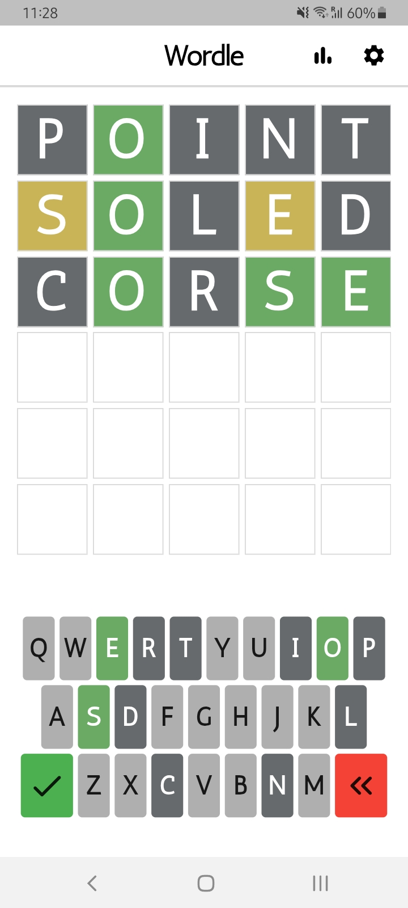
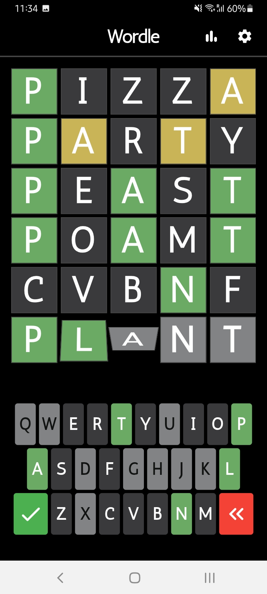
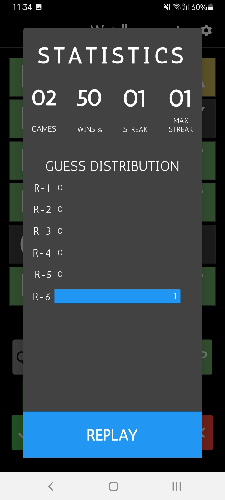

## This is the **Wordle Game** made with Flutter

- It has more than 150 words.
- It has the same animation as the original one.
- Comes with a light and dark theme.
- It has easy and hard mode.
- Statistics page tells all the game stats (streak, win %, etc...).

 

## Libraries and Packages used:
1- <a href="https://pub.dev/packages/charts_flutter_new">charts_flutter_new: 0.12.0</a>

2- <a href="https://pub.dev/packages/provider">provider: 6.0.5</a>

3- <a href="https://pub.dev/packages/shared_preferences">shared_preferences: 2.2.0</a>

 

## App Screenshots

| Light Page | Dark Page | Stats |
| :-: | :-: | :-: |
 |  |  |

 
